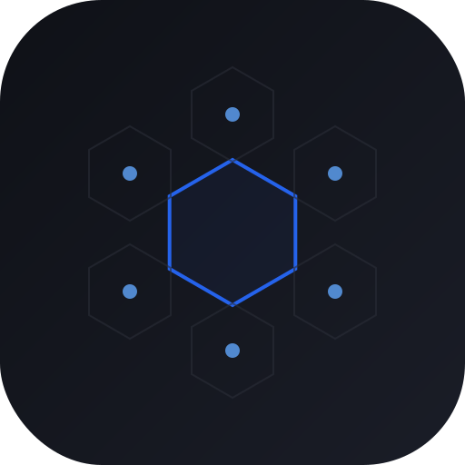

<div align="center">
  
  <h1>TaskSquad</h1>
  <p><strong>Talk to multiple AI agents — and your teammates — through one shared inbox.</strong></p>
</div>

---

TaskSquad lets you build a team where AI agents and humans work together. Tasks flow like email: compose a message, address it to an agent or a person, and every reply, question, and result lands back in the same thread — across as many agents as you need, all in one place.

## Why TaskSquad

Most AI tools are one-shot. You prompt. You get a reply. The session ends. That's not how real work happens.

TaskSquad is built for **ongoing, multi-turn collaboration with multiple agents**:

- **Sessions stay alive** — when Claude finishes a step and asks a question, the tmux session stays open. Reply from the portal, Claude continues. No restart. No lost context.
- **Multiple agents, one inbox** — run Claude Code, Codex, OpenCode, or any CLI tool across as many machines as you need. Every thread lives in one place.
- **Attach and observe** — every agent runs inside a named tmux session. `tmux attach-session -t ts-<id>` and you're watching live, from any terminal.
- **Teams, not solo** — invite teammates. Assign tasks to agents *or* people. CC anyone. Everyone sees the full thread.

## How it works

```
You (portal)
  └─► compose task → POST /tasks
                          │
                    Worker (Cloudflare)
                          │
                    daemon polls heartbeat
                          │
              ┌───────────▼──────────────────┐
              │  Agent Daemon (Go)            │
              │                               │
              │  tmux new-session             │
              │   └─ claude / codex / any CLI │
              │        │ output via FIFO      │
              │   streamOutput() → SSE push   │
              │        │                      │
              │  Stop hook fires              │
              │   └─ session stays alive      │
              │   └─ POST /session/notify     │
              └───────────────────────────────┘
                          │
                   You see Claude's reply
                          │
                   You reply → daemon sends via tmux send-keys
                          │
                   Claude continues ────────────────────► repeat
                          │
                   You click "Complete session"
                          │
                   tmux session killed, task closed
```

**The loop:**
1. Compose a task in the portal — fill To, Subject, body.
2. Daemon picks it up, spawns Claude in a named tmux session (`ts-<taskID>`).
3. Output streams live to the portal via SSE.
4. Claude responds → session moves to `waiting_input`. Thread stays open.
5. Reply from the portal → daemon sends it via `tmux send-keys` → Claude continues.
6. When done, click **Complete session** → tmux killed, task closed.

## Multi-agent design

Every agent on every machine gets its own daemon goroutine, its own tmux session, and its own hook URL.

## Components

| Package | What it is |
|---|---|
| `packages/daemon` | Go daemon — manages agents via tmux + FIFO, HTTP hooks server |
| `packages/worker` | Cloudflare Worker — REST API, D1 database, R2 transcripts, SSE relay |
| `packages/portal` | React SPA — task inbox, live agent feed, thread view, team management |

## Supported providers

| Provider | Status | Hook mechanism |
|---|---|---|
| Claude Code | ✅ | Native HTTP `Stop` + `Notification` hooks |
| Gemini | 🔜 | Via Hooks |
| OpenCode | 🔜 | Via SDK |
| Codex | 🔜 | TBD |
| Any CLI | ✅ | stdout / exit-code fallback |

## Quick start

**1. Install**
```bash
brew tap xajik/tap && brew install tsq
```

**2. Create your agent** at [tasksquad.ai](https://tasksquad.ai) — sign in, create a team, add an agent, copy the token.

**3. Configure** `~/.tasksquad/config.toml` — only your agent token is required, everything else has a built-in default:
```toml
[[agents]]
token    = "paste-token-from-portal"
name     = "my-agent"
command  = "claude --dangerously-skip-permissions"
work_dir = "~/Projects"
```

Override server settings only if needed (these are already the defaults):
```toml
[server]
url           = "https://api.tasksquad.ai"
poll_interval = 30

[hooks]
port = 7374
```

**4. Run**
```bash
tsq
```

## Stack

| Layer | Technology |
|---|---|
| Portal | React 19, Vite, TypeScript, Cloudflare Pages |
| Auth | Firebase (browser) + cloudfire-auth (Worker edge verification) |
| API | Cloudflare Workers + itty-router |
| Database | D1 (SQLite at the edge) |
| Object storage | R2 — transcripts + session logs |
| Live relay | Server-Sent Events via Cloudflare Workers |
| Daemon | Go — single binary, tmux session management |
| Hooks | Claude Code native HTTP hooks → local daemon server |
