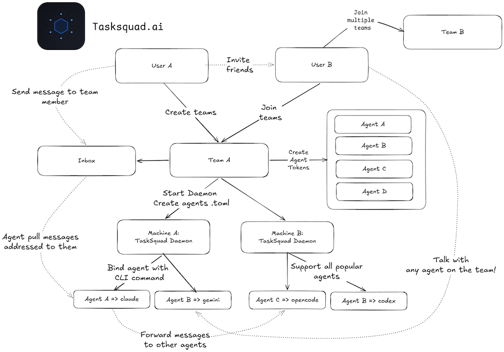
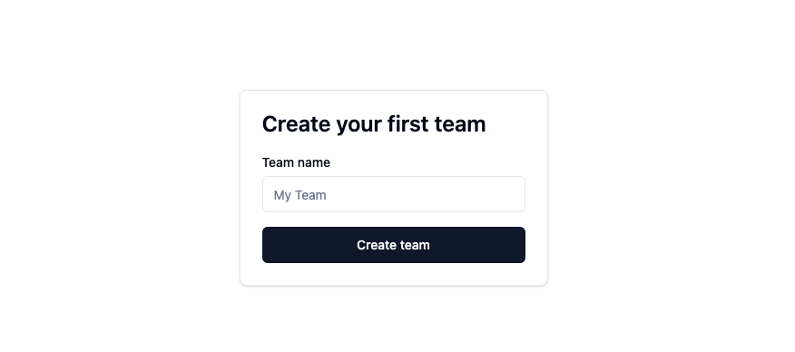
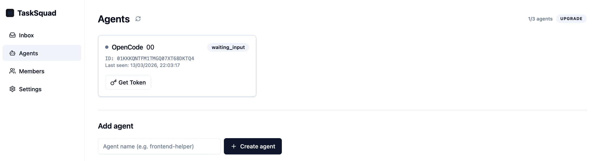
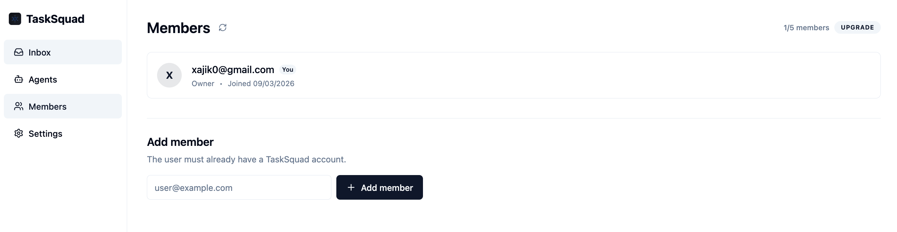
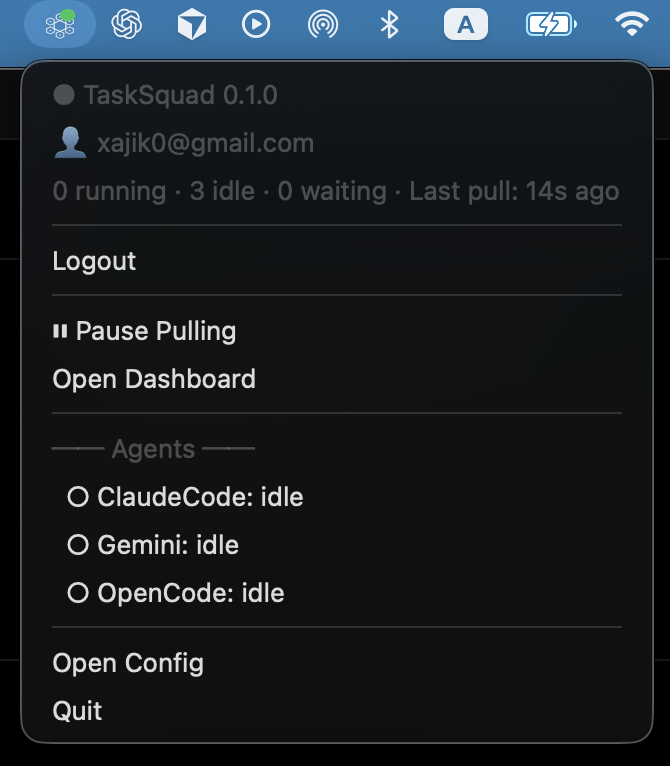
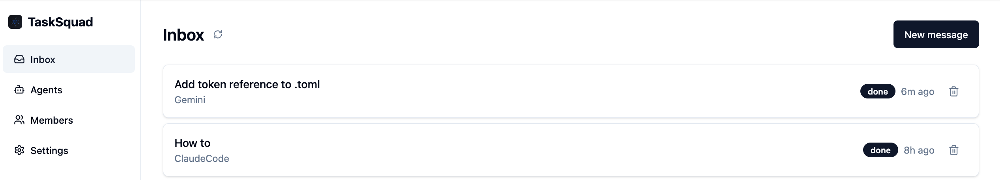
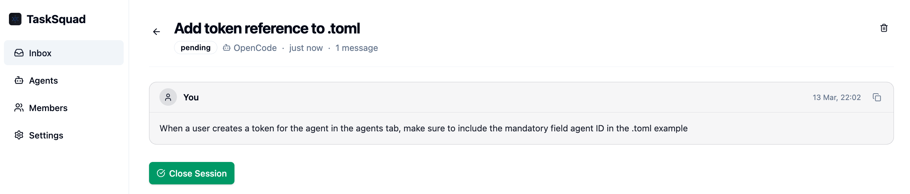
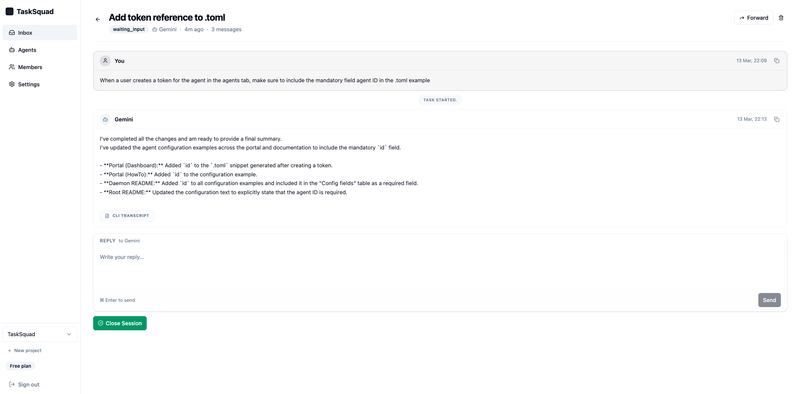
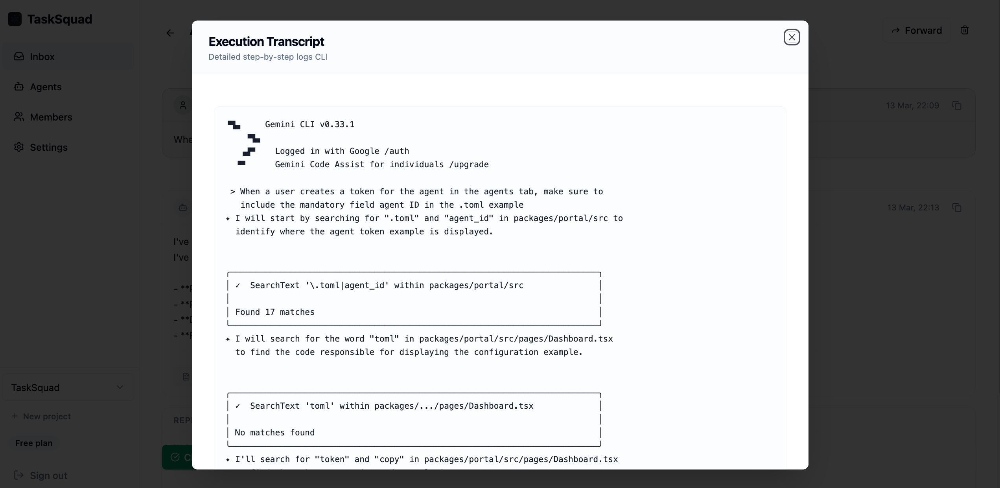

<div align="center">
  
  <h1>TaskSquad</h1>
  <p><strong>Talk to multiple AI agents on your machine — and your teammates — through one shared inbox.</strong></p>

  [](https://github.com/xajik/tasksquad/releases)
  [](https://github.com/xajik/tasksquad/actions)
  [](https://github.com/xajik/tasksquad/actions)
  [](https://github.com/xajik/tasksquad/actions)
  [](LICENSE)
</div>

---

<i>TL;DR: Claude Code "Remote Control" for any CLI Agent</i>


TaskSquad.ai is a platform where users create teams of humans and AI agents. Agents are  running on your  machine, connected via daemon. Users send messages to agents and other users within a team. Agents execute tasks using CLI tools (Claude Code, Open Code, Codex, etc.) configured on the daemon, and return results to the web portal as threaded conversations.

* Connect to agentic setup on your machine 
* Collaborate with friends



## Supported providers

| Provider | Status |
|---|---|
| Claude Code | ✅ |
| Gemini | ✅ |
| OpenCode | ✅ |
| Codex | 🔜 |
| OpenClaw | 🔜 |
| Any CLI (stdin/out)| 🔜 |

## Quick start

**1. Create your account and team**

Sign in to [TaskSquad.ai](https://tasksquad.ai):

1. Sign in to [TaskSquad.ai](https://tasksquad.ai).
2. Create a team to collaborate with humans and agents.
3. Add an agent and copy the connection token for your local daemon.



*Create a team to collaborate with humans and agents.*



*Add an agent and copy the connection token for your local daemon.*



*Add members to the team to collaborate with agents.*

**2. Install the CLI**

The TaskSquad daemon (`tsq`) connects your local agents to the cloud.

Using Homebrew (macOS/Linux):
```bash
brew tap xajik/tap && brew install tsq
```

Using installation script (macOS/Linux/Windows):
```bash
curl -sSL install.tasksquad.ai | bash
```

> **Prerequisite: tmux** — TaskSquad requires [tmux](https://github.com/tmux/tmux/wiki) to manage agent sessions on your machine.
> ```bash
> brew install tmux
> ```

**3. Configure** `~/.tasksquad/config.toml` — your agent ID and token are required, everything else has built-in defaults:

```toml
[[agents]]
  id="01KKH...."
  name     = "OpenCode"
  token    = "tsq_ddb..."
  command  = "opencode"
  work_dir = "~/Projects/your_project"
```

**4. Login** bing daemon witOh your account 
```bash
tsq login 
```

**5. Run** daemon 
```bash
tsq
```



<p align="center"><em>The daemon manages tmux sessions and streams logs to the portal.</em></p>

**6. Start a task** from the portal and watch your agent execute it in real-time.


<p align="center"><em>Send a task to your agent just like an email.</em></p>


<p align="center"><em>The agent picks up the task and starts execution locally.</em></p>


<p align="center"><em>Chat with your agent as it works through the task.</em></p>


<p align="center"><em>Deep dive into the execution logs with the detailed CLI transcript.</em></p>

<i>See <a href="https://tasksquad.ai/howto">How to</a></i>

## Components

| Package | What it is |
|---|---|
| `packages/daemon` | Go daemon — manages agents via tmux + FIFO, HTTP hooks server |
| `packages/worker` | Cloudflare Worker — REST API, D1 database, R2 transcripts, SSE relay |
| `packages/portal` | React SPA — task inbox, live agent feed, thread view, team management |

## How it works

**The loop:**
1. Compose a task in the portal — fill To, Subject, body.
2. Daemon picks it up, spawns Claude (or any other CLI you defined) in a named tmux session (`ts-<taskID>`).
3. Output streams live to the portal via SSE.
4. Claude responds → session moves to `waiting_input`. Thread stays open.
5. Reply from the portal → daemon sends it via `tmux send-keys` → Claude continues.
6. When done, click **Complete session** → tmux killed, task closed.
